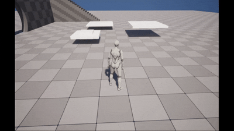

# 【UE5】アクターの移動～元の位置まで戻す

# 目的
・移動する足場を開始地点まで戻る動作にしたい

# 要件
・足場のスタート位置を把握する  
→SLと呼称  
・SLをゲーム開始時にアクター位置の取得を呼び出して取得する  
・それをメンバー変数に保存する  
・スタート位置と足場の位置（現在地）の取得  
・ある地点まで移動したら戻るようにする  

# 結果
いい感じに足場移動がループするようになった

# 感想
・IF文と比較演算子をようやくC++で使う機会が登場！！テンション上がる
・この処理BPだと一発でできたりしないかな～とか思うなど

